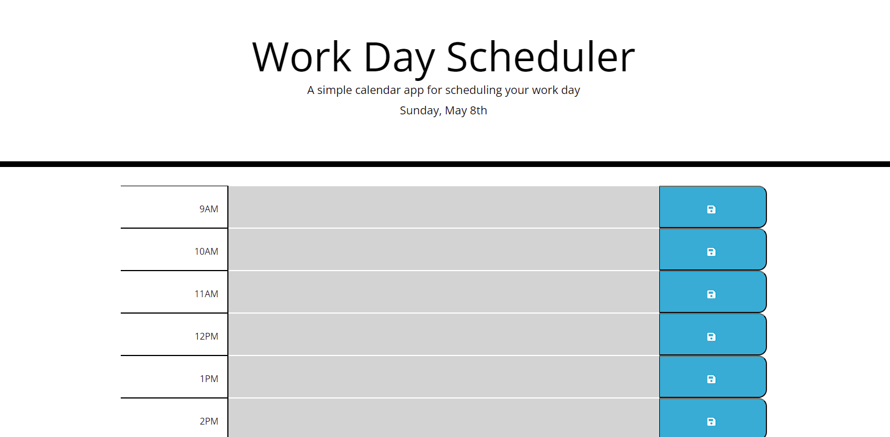

# Work Day Scheduler

## Table of Contents

*[What](#what)

*[Screenshots](#screenshots)

*[What-I-Learned](#what-i-learned)

*[Link](#Link)

## What

A simple daily planner built using HTML, CSS, and Js. The site utilizes the Bootstrap css framework as well as Jquery and Moment.js.
Moment.js tracks the time of day and updates the status via colors. Jquery is utilized to make selecting elements easier. Bootstrap 
makes the site more responsive by simplifying the layout at different screen sizes.

## Screenshots

## What I Learned

Utilizing css frameworks can make styling so much easier. 3rd party Api's like moment make handling time and time related math a breeze.
Jquery makes selecting elements and other things more intuitive. All in all I enjoyed this challenge!

## Link

https://bmkersey.github.io/Planner/